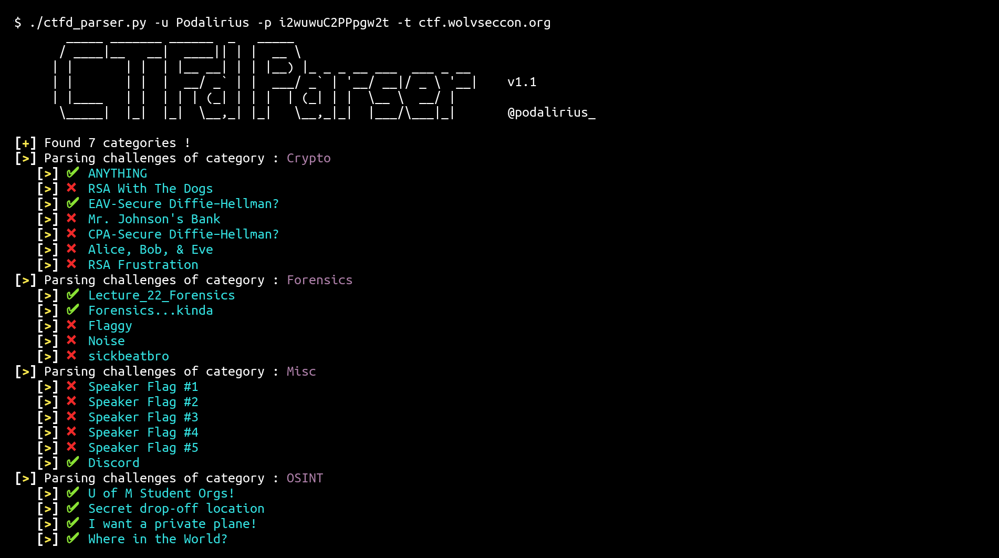

<p align="center">
    A python script to dump all the challenges locally of a CTFd-based Capture the Flag.
    <br>
    
    <a href="https://twitter.com/intent/follow?screen_name=podalirius_" title="Follow"></a>
    <a href="https://www.youtube.com/c/Podalirius_?sub_confirmation=1" title="Subscribe"></a>
    <br>
</p>

## Features

 - [x] Connects and logins to a remote CTFd instance.
 - [x] Dumps all the challenges by category.
 - [x] Download attached files.
 - [x] Prints a ✔️ or a :x: to indicate if the challenge is solved or not.
 - [x] Setup template file in challenge dir : writeup.md / solve.py (optionnal)

## Usage

```
$ ./ctfd_parser.py -h
       _____ _______ ______  _   _____
      / ____|__   __|  ____|| | |  __ \
     | |       | |  | |__ __| | | |__) |_ _ _ __ ___  ___ _ __
     | |       | |  |  __/ _` | |  ___/ _` | '__/ __|/ _ \ '__|    v1.1
     | |____   | |  | | | (_| | | |  | (_| | |  \__ \  __/ |
      \_____|  |_|  |_|  \__,_| |_|   \__,_|_|  |___/\___|_|       @podalirius_

usage: ctfd_parser.py [-h] -t TARGET -u USER -p PASSWORD [-T THREADS] [-v]
or
usage: ctfd_parser.py [a config.json must be in project root dir, containing a least target, user & password]

CTFdParser

optional arguments:
  -h, --help            show this help message and exit
  -t TARGET, --target TARGET
                        CTFd target (domain or ip)
  -u USER, --user USER  Username to login to CTFd
  -p PASSWORD, --password PASSWORD
                        Password to login to CTFd
  -T THREADS, --threads THREADS
                        Number of threads (default: 8)
  -v, --verbose         Verbose mode. (default: False)
  -I, --initfile        Activate setup template files

```

## Demonstration



## Contributors

Pull requests are welcome. Feel free to open an issue if you want to add other features.
